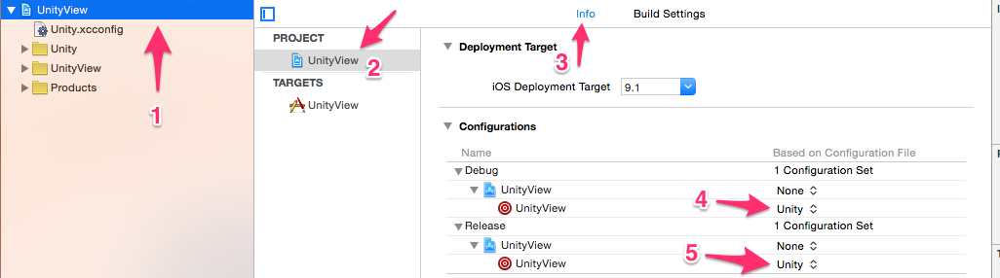

# Adding Unity to Xcode using Swift

This tutorial will cover the simplest way to add a Unity project to a new or existing Xcode project.

## Overview
* Export Unity project
* Add the Unity.xcconfig file provided in BlitzAgency repo
* Adjust iOS Export Path
* Add a new run script build phase
* Import your unity project
* Clean up your unity project
* Add the objc folder in the BlitzAgency repo with the new custom unity init and obj-c bridging header
* Rename main function in main.mm
* Alter the application delegate and create a main.swift file.
* Wrap the UnityAppController into your application delegate
* Adjust the GetAppController function in UnityAppController.h
* Go bananas, you did it! Add the unity view wherever you want!

## Getting Started
### In Unity
Start by creating a new scene in Unity. Once your scene is complete select:

* File -> Build Settings
* Select the scene(s) you want to export
* Make sure you are exporting to iOS
* Run in export should be set to: Debug
* Select Player Settings - Here you can choose all your preferred device orientation. Make sure your scripting Backend should be set to il2cpp

Save to a new folder

Your exported Unity project will have an Xcode project in it. Open this.

### In Xcode
Ok! Fire up Xcode and create a new Swift project or open an existing Swift project.

#### Add the Unity.xcconfig file provided by BlitzAgency

Copy the Unity.xcconfig file into your Xcode project and create a new Group. Put this at the topmost folder level as shown. Set the project to use those settings.

